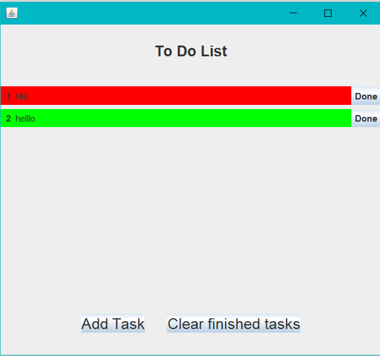

# ToDoList App

A robust ToDo List application built in **Java** for task management. This application allows users to organize their daily tasks efficiently with features like adding, editing, deleting, and marking tasks as completed.

## Features
- **Add Tasks**: Create and store new tasks.
- **Edit Tasks**: Update the details of existing tasks.
- **Delete Tasks**: Remove completed or unnecessary tasks.
- **Mark as Completed**: Track completed tasks visually.

## Technologies Used
- **Java SE**: Core programming language.
- **Java Swing/JavaFX**: For building a graphical user interface (GUI).

## Requirements
- **Java Development Kit (JDK)** version 8 or higher.
- An Integrated Development Environment (IDE) like IntelliJ IDEA, Eclipse, or NetBeans.

### Prerequisites
- Ensure **JDK** is installed and added to your system's PATH.
- Install an IDE for running and editing the project.

## Screenshots

## Future Enhancements
- **Database Integration**: Use JDBC to connect the application to a database like MySQL or SQLite.
- **Cloud Synchronization**: Sync tasks across multiple devices using an online backend.
- **Categorization**: Allow tasks to be grouped by categories.
- **Reminders**: Add notification functionality for due tasks.

## License
This project is licensed under the MIT License. See the [LICENSE](LICENSE) file for more details.

## Contact
Developed by **Aditya Raj**. Feel free to reach out!

 
